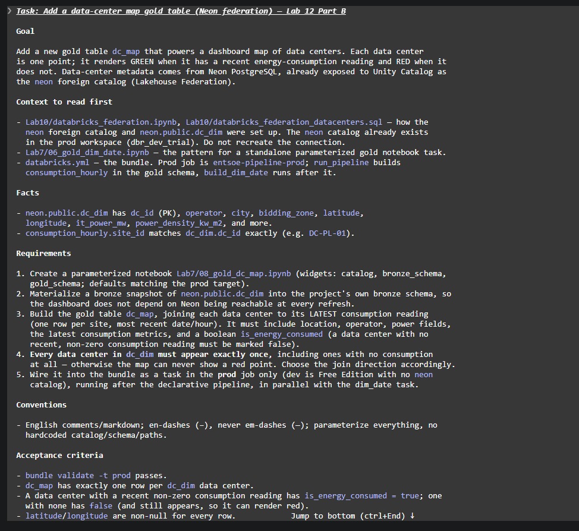
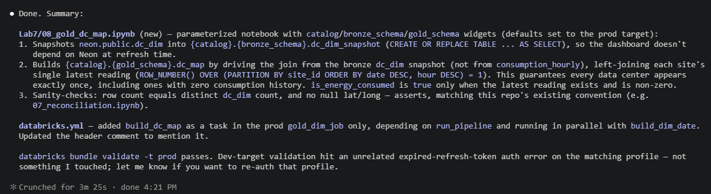
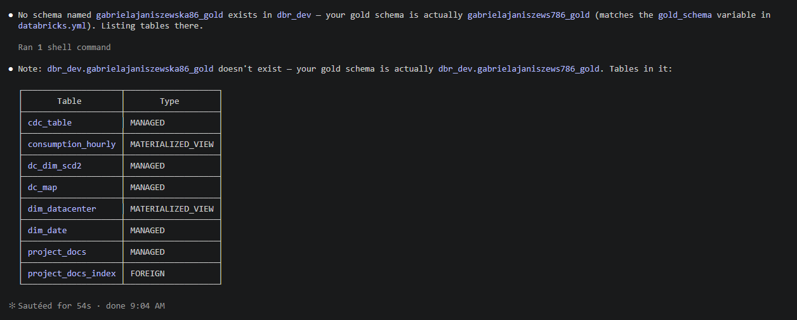
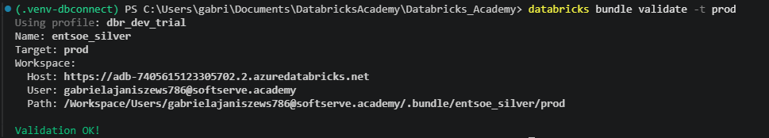

# Lab 12 – AI Capstone: RAG & AI-Assisted Development

Goal: build a RAG / knowledge assistant on top of the datacenter energy-cost platform (Labs 3-11)
and use an AI coding agent with the Databricks AI Dev Kit to build and ship a new component through
the Asset Bundle / CI-CD flow.

## Part A – RAG on Databricks (`GenAI/GenAI_ENTSOE_demo.py`)

### 1. Dataset and preparation
- Document dataset: the project's own `README` files (internal knowledge) plus the ENTSO-E "Detailed
  Data Descriptions" PDF (external reference).
- Raw text is cleaned and split into chunks – README by markdown section, PDF by page – and each
  chunk is tagged with metadata (`doc_name`, `section`, `doc_type`).

### 2. Embeddings, governed storage, Vector Search
- Chunks are written to a Delta table with Change Data Feed on, then indexed with a Delta Sync
  Vector Search index using managed embeddings (the index type available on the trial).
- Retrieval uses top-k search (k = 3) with **metadata filtering** on `doc_type`: two retriever tools,
  `search_internal_docs` (project docs) and `search_entsoe_glossary` (ENTSO-E terminology). The same
  query routed through each tool returns different corpora – demonstrable filtering, not just config.

### 3. QA workflow (agent)
- One LangGraph agent with two Unity Catalog SQL function tools (`get_energy_cost`,
  `list_bidding_zones`) over `consumption_hourly`, plus the two retrievers. It retrieves context,
  passes it to the LLM, and generates the answer, routing numeric vs documentation questions to the
  right tool.

### 4. Evaluation and comparison
- With vs without retrieval: the same question is sent to the tool-enabled agent and to a no-context
  agent (identical prompt, no tools). The grounded agent returns figures traceable to
  `consumption_hourly` (~79,855 EUR for PL in September); the no-context agent fabricates a value four
  orders of magnitude off and even narrates calling tools it cannot reach.
- Golden set (5 questions) scored with MLflow LLM judges `Correctness` and `RetrievalGroundedness`
  (relevance / hallucination risk / missing context).
- **Findings (kept honest, not tuned away):** the eval fan-out exceeds the trial's pay-per-token QPS
  limit on the Llama endpoint (`429 REQUEST_LIMIT_EXCEEDED`), so some traces fail intermittently –
  mitigated by cutting to 5 questions and 2 judges. One documentation question also scores below the
  bar because its expected fact is not surfaced from the indexed corpus – a genuine coverage gap,
  reported rather than hidden.

### 5. Monitoring and governance
- `mlflow.langchain.autolog()` logs every prompt, tool call and response as a trace in Experiments.
- Secure access: the SQL tool reads `consumption_hourly`, which carries a row filter
  (`regional_filter`) and a column mask (`site_id_mask`) from `Lab6/07_RLS_CLS`. The agent inherits
  them – no access-control code in the agent. `DESCRIBE EXTENDED` proves they are attached; a steward
  view and a restricted (Poland-scoped, masked) view are shown side by side.

### Discussion
- **Why RAG beats prompting alone:** the no-context comparison shows the LLM confidently inventing
  numbers it cannot know; retrieval grounds answers in the governed gold layer and the source docs.
- **Chunk size vs retrieval quality:** README is chunked by section and the PDF by page (~2000-char
  cap). Smaller chunks sharpen retrieval precision but can split context; page-level chunks keep
  reference definitions whole at the cost of some noise.
- **Governance and cost for GenAI:** access control is inherited from the table, not re-implemented
  in the agent; cost/rate are constrained by the trial's pay-per-token endpoint, which is why
  evaluation had to be scoped down – a real production trade-off (pay-per-token vs provisioned
  throughput).

## Part B – AI-Assisted Development with the Databricks AI Dev Kit

Goal: build a new gold component with a coding agent and ship it through the Asset Bundle.

### Component built with the agent
- **`Lab7/08_gold_dc_map.ipynb`** (agent-built from a requirements spec, then reviewed): snapshots
  `neon.public.dc_dim` (Neon PostgreSQL via Lakehouse Federation, `neon` foreign catalog from Lab 10)
  into a bronze table, then builds the gold table `dc_map` by driving the join from the data-center
  snapshot and left-joining each site's latest consumption reading. Every data center appears exactly
  once, so the map can show red points; `is_energy_consumed` is true only for a recent non-zero
  reading.
- **Asset Bundle:** the agent extended `databricks.yml` with a `build_dc_map` task that runs after the
  declarative pipeline, in parallel with `build_dim_date`, and it was **deployed through the bundle**
  to prod.

### AI Dev Kit setup
- The kit is installed in the repo (`.ai-dev-kit/`, skills registered for the coding agent).
- The kit's MCP server (`databricks-mcp-server`) is registered with the coding agent via `.mcp.json`
  (project scope, `DATABRICKS_CONFIG_PROFILE=dbr_dev_trial`), exposing the executable Databricks tools
  (SQL, Unity Catalog inspection, jobs, pipelines). It was used to inspect Unity Catalog and run SQL
  against the gold layer directly from the agent.

### Reflection – where the agent helped, where human review was essential
- **Accelerated:** the notebook (federation snapshot + gold join + sanity asserts) was produced
  quickly and was sound on first review.
- **Human review essential:** the agent placed the bundle task in the wrong job, because the branch it
  worked on lacked the latest pipeline structure. Fixing it meant bringing the current `databricks.yml`
  (consolidated `entsoe-pipeline-prod`, dedup and `ignoreDeletes` fixes) into the branch and
  re-placing the task. Lesson: give the agent the current source of truth before it edits shared
  config, and never deploy agent output blindly – it goes through review and `bundle validate` first.

### Evidence
- **What the agent was given** – the exact requirements prompt (requirements and acceptance criteria,
  not ready code), saved as `GenAI/part_b_agent_task.md` and shown below:

- **What the agent produced** – its session summary of the notebook and Asset Bundle changes:

- **MCP server registered and used** – the agent used the AI Dev Kit `databricks-mcp-server` to
  inspect Unity Catalog and list the gold-schema tables (`dc_map`, `dim_datacenter`,
  `consumption_hourly`, …). It even caught a typo in the schema name and pointed to the correct
  `gabrielajaniszews786_gold`:

- **Bundle validated before deploy** – `databricks bundle validate -t prod` passes on the current
  branch:

## Guardrails used
- `databricks bundle validate -t prod` before every deploy; changes reviewed as diffs, not deployed
  blindly.
- Governance (RLS + CLS) inherited by the agent from the governed gold table.
- Evaluation with LLM judges as a quality gate; findings documented.

## Done when
- [x] RAG assistant answers questions with retrieved context (dual corpus, metadata filtering).
- [x] At least one component built with agent assistance (`dc_map`) and deployed via the bundle.
- [x] Short write-up on the guardrails used (above).
