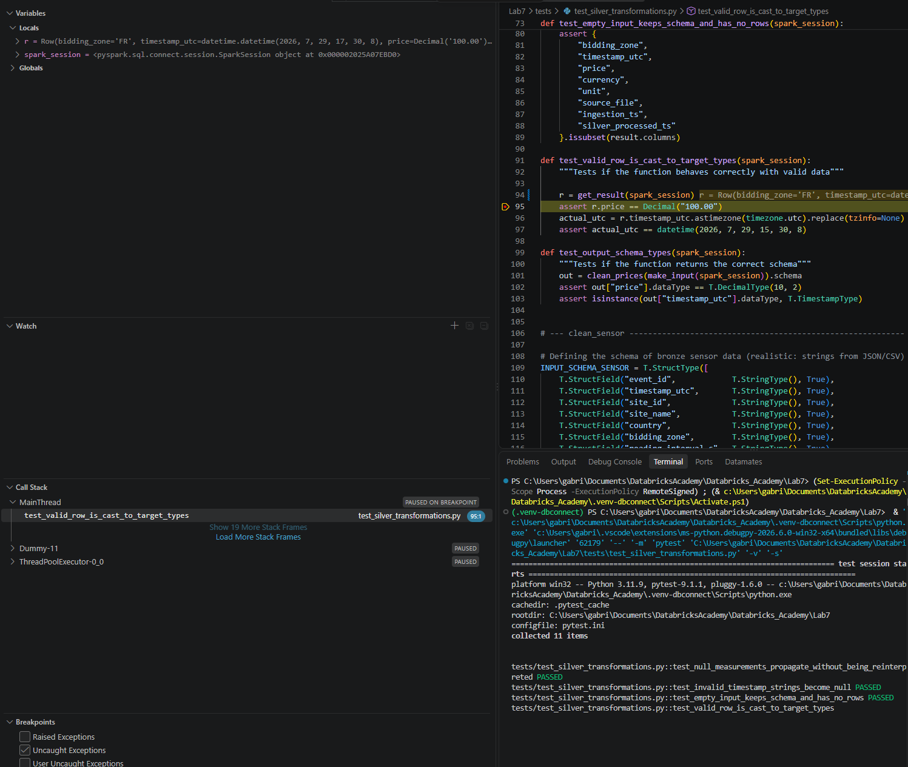
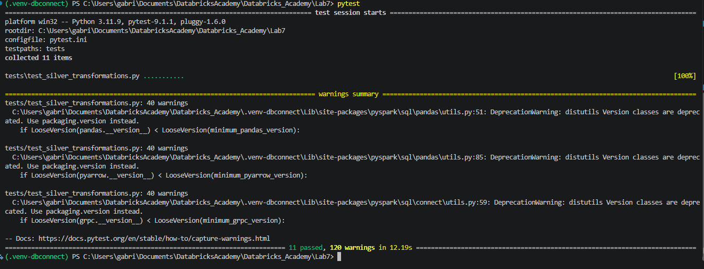
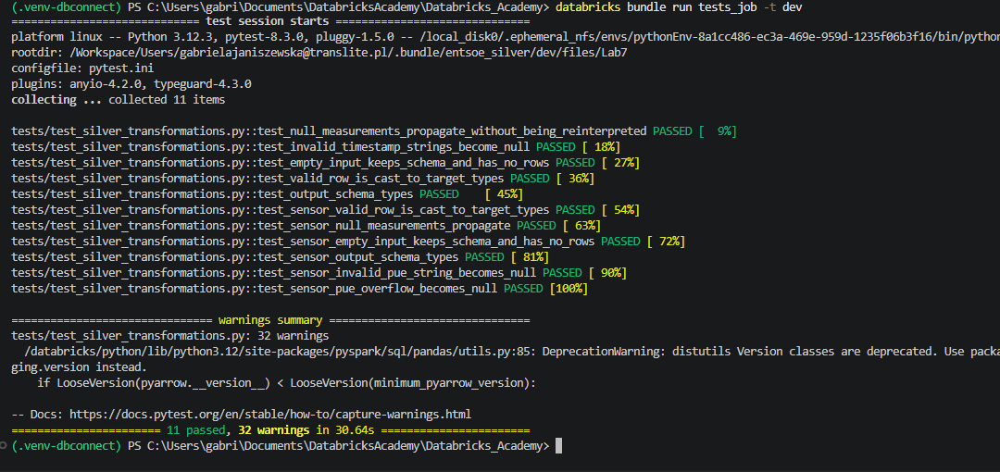
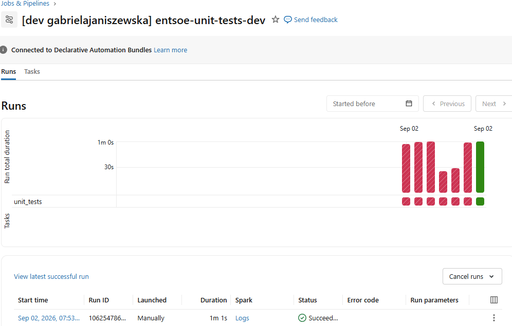

## Testing

Transformation logic now lives in importable modules (`silver_transformations.py`), so the same
pytest suite can run in three ways. Which Spark engine is used is decided by `conftest.py`
based on the installed package (pyspark = local, databricks-connect = remote serverless).

| # | Scenario | Purpose | Compute | Command |
|---|----------|---------|---------|---------|
| 1 | Debug from local IDE (Databricks Connect) | Step through a transform on real data with breakpoints | Remote serverless (Free Edition) | run/debug in VS Code, `.venv-dbconnect` |
| 2 | Run tests against remote Spark (Connect) | Prove the suite passes on remote Spark | Remote serverless | `pytest` in `.venv-dbconnect` |
| 3 | Headless via CLI / bundle | Unattended run (CI-style), no IDE | Local (CI) / serverless job | `pytest` and `databricks bundle run` |

### 1. Interactive debug from the IDE (Databricks Connect)

- Session: `DatabricksSession.builder.serverless().getOrCreate()`.
- Evidence: screenshot of VS Code stopped on a breakpoint inside `clean_prices`,
  Variables panel showing the DataFrame, run against remote serverless.

  

### 2. Run the tests against remote Spark (Connect)

- Evidence: pytest output with all tests PASSED:

### 3. Headless via the Databricks CLI / bundle
Two forms, both "no IDE":
- Local headless:

- On-platform, as a bundle job (runs on serverless, triggered from the CLI):

