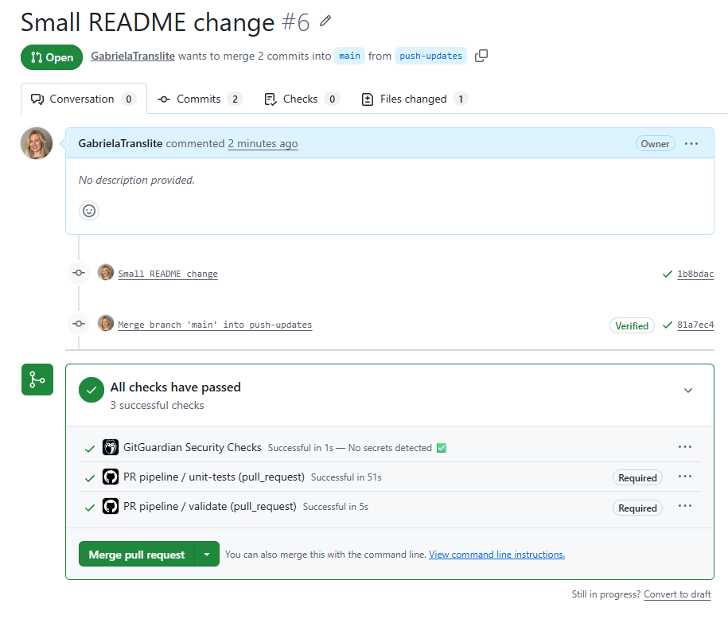
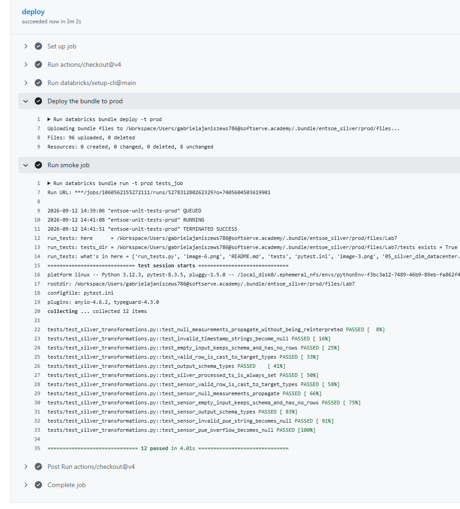

# Lab 8 - CI/CD: DEV to PROD Promotion

Automated, production-grade promotion of the ENTSO-E / data-center platform from the DEV workspace
(Databricks Free Edition) to the paid PROD workspace (Azure Databricks), driven entirely by Git.
A merge to `main` deploys the whole bundle to prod with no manual steps, and a deployed job runs green.

## Goal

The data platform was already built as a Databricks Asset Bundle with `dev` and `prod` targets.
Lab 8 closes the promotion loop: non-interactive authentication, an automated deploy pipeline,
permissions and DDL as code, and idempotent, repeatable deployments with no hand edits in prod.

## Architecture

One bundle (`entsoe_silver`), two targets:

- `dev` - Databricks Free Edition. Bronze from the synthetic generator. The declarative pipeline runs
  serverless, which is the only option on Free Edition.
- `prod` - Azure Databricks. Bronze from the real ENTSO-E API and the Azure Event Hub stream. Classic
  compute on the shared cluster.

Two GitHub Actions workflows implement the pipeline:

- `pr_pipeline.yml` runs on every pull request: unit tests plus `databricks bundle validate -t prod`.
  Nothing is deployed. This is the quality gate before prod.
- `cd.yml` runs on merge (push) to `main`: `databricks bundle deploy -t prod`, then a headless smoke
  job. This is the only path into production.

Branch protection on `main` makes both PR checks required, so the only way to change prod is a
reviewed, green merge.

## Authentication

CI runners are headless and cannot perform interactive `databricks auth login`. Deployment uses a
Databricks personal access token (PAT) scoped to `all-apis`, stored as GitHub repository secrets
`DATABRICKS_HOST` and `DATABRICKS_TOKEN`. The CLI reads them from the environment automatically. The
token belongs to my own user, so CI deploys as me into my own workspace folder and jobs run as me.

A service principal with OAuth machine-to-machine authentication is the production-grade next step: a
machine identity, short-lived tokens, and deterministic ownership independent of any person. It is
documented here as the productionization path and can replace the PAT without changing the rest of
the pipeline.

## Compute strategy

The paid workspace disallows serverless for notebooks, exposes shared clusters GP1 and GP2, and
provides job and all-purpose cluster policies but no pipeline (DLT) policy.

- Jobs (unit tests, gold plus dim, silver ingestion) attach to the shared GP1 cluster through
  `existing_cluster_id`, referenced by a `prod_cluster_id` variable.
- The Lakeflow declarative pipeline cannot attach to an existing cluster, so on prod it is switched to
  classic compute (`serverless: false`) with a self-configured single-node cluster and no policy. On
  dev it stays serverless because Free Edition requires it.
- The DQX quality library is installed through the pipeline `environment` dependencies, which is the
  supported method on both serverless and classic compute.

## Promotion as code

Everything in prod comes from Git, nothing from manual clicks:

- Pipelines (the Lakeflow declarative pipeline)
- Jobs (unit tests, gold plus dim, silver ingestion) with their compute
- Notebooks and Python source files
- Dashboards (ENTSO-E Data Quality, Datacenter Energy Cost)
- Permissions (CAN_MANAGE on the prod target)
- Per-target presets (production mode, trigger pause status)

Deployments are idempotent: re-running the deploy with no code change reports zero resource changes.

## Evidence

### 1. Pull request gate

Every pull request runs the unit tests and the bundle validation. Both are required before merge, and
branch protection enforces it. GitGuardian additionally confirms that no secrets were committed.

### 2. Continuous deployment and idempotency

On merge to `main`, the CD workflow deploys the bundle to prod and runs the smoke job. The deploy step
reports `Resources: 0 created, 0 changed, 0 deleted, 8 unchanged`, which is both the deployment
summary and proof of idempotency: the resources already matched the declared state, so nothing was
recreated. The smoke job `entsoe-unit-tests-prod` (12 tests) then runs green.

## Done when

- [x] The whole project is a Databricks Asset Bundle with `dev` and `prod` targets.
- [x] On pull request, tests and `bundle validate` run and gate the merge.
- [x] On merge to `main`, `bundle deploy` promotes to the paid workspace with no manual steps.
- [x] Pipelines, jobs, notebooks, dashboards and permissions are promoted as code.
- [x] Deployments are idempotent.
- [x] A deployed prod job runs green.

## Reproduce

See [`../GIT_WORKFLOW.md`](../GIT_WORKFLOW.md) for the exact branch, PR and merge commands. In short:
branch, edit, `bundle validate -t prod` locally, push, open a pull request, let the checks pass,
merge, and CD deploys to prod.

## Next steps

- Replace the PAT with a service principal (OAuth M2M) for team-owned, rotatable prod authentication.
- Optionally provision the Azure side (resource group, storage, Key Vault, Event Hub, workspace, Unity
  Catalog external location) with Terraform, keeping infrastructure and bundle assets in separate
  layers.
- Align the promoted dashboards' datasets with the prod catalog and schemas.
